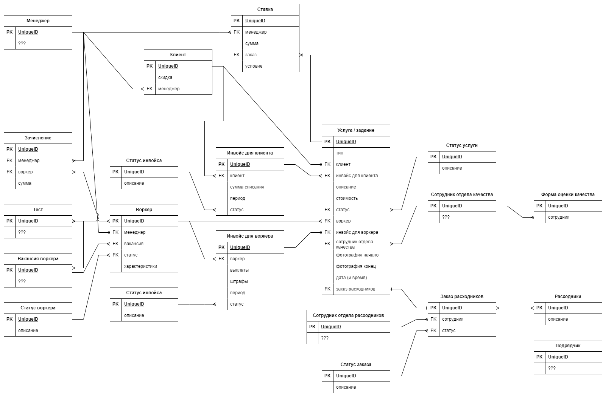
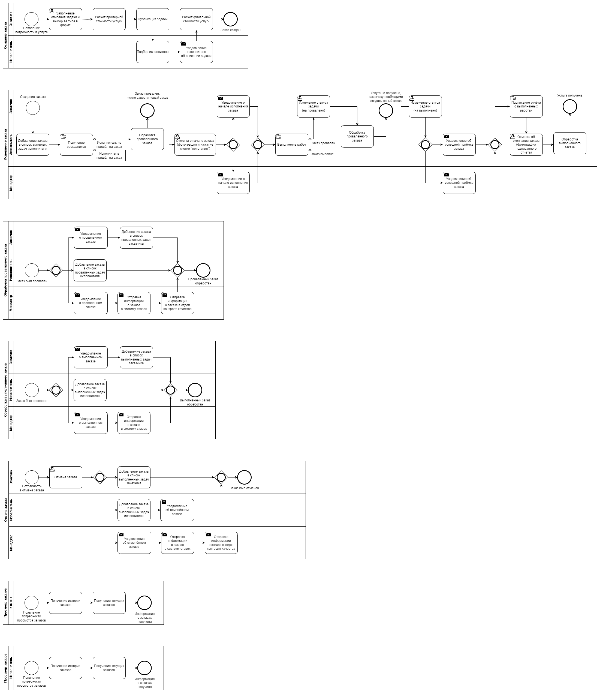
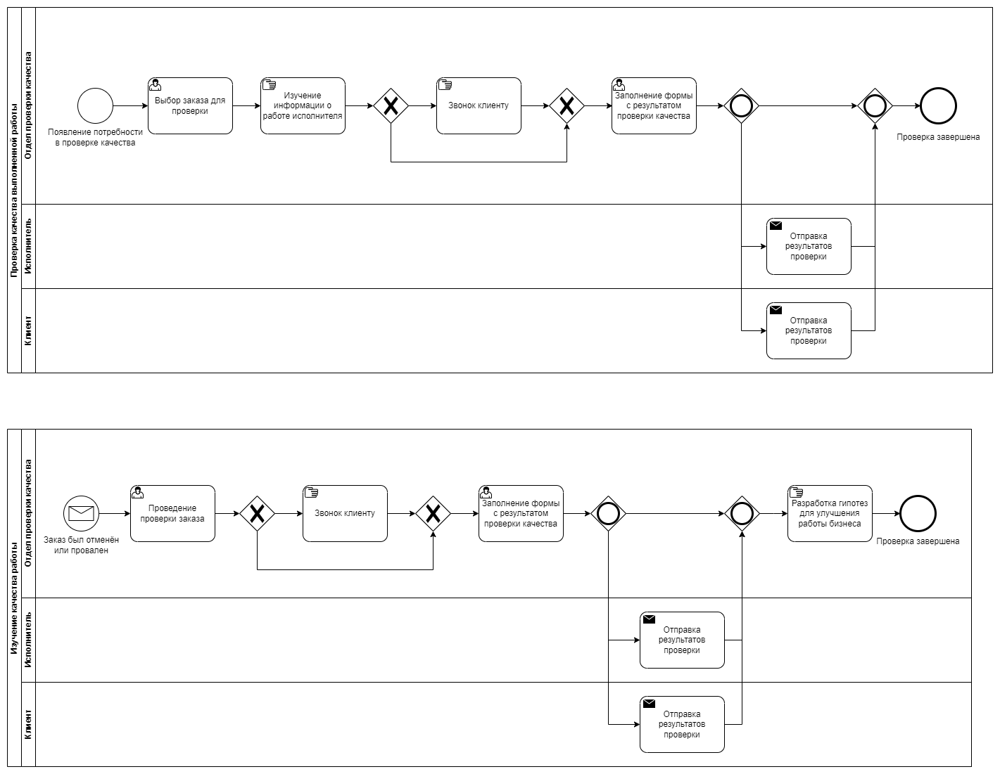
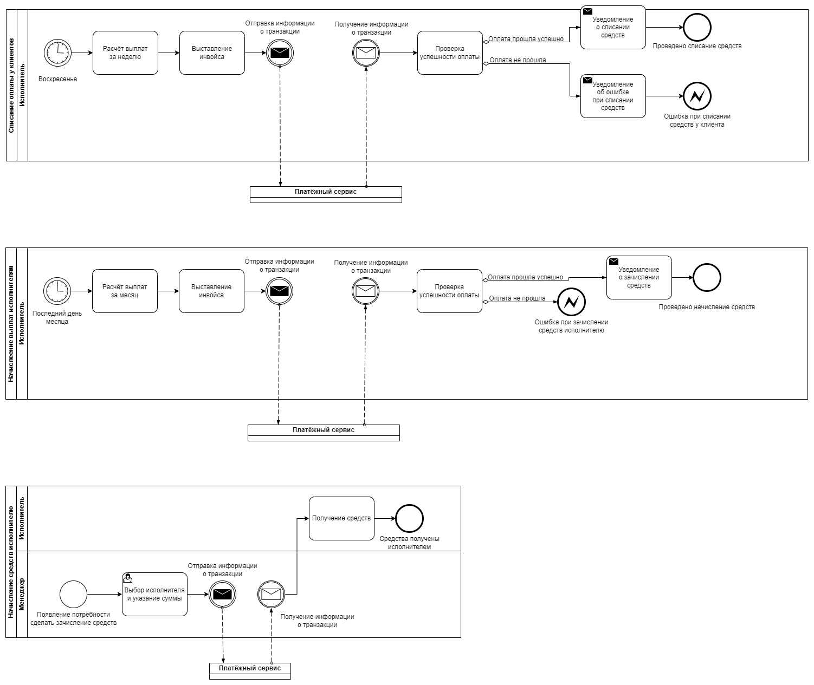
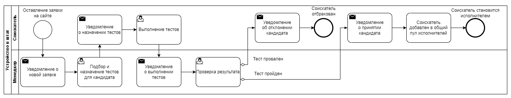
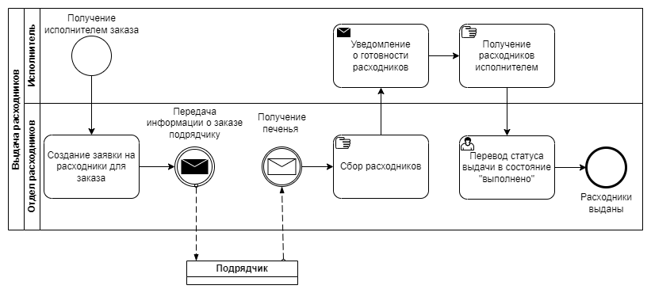
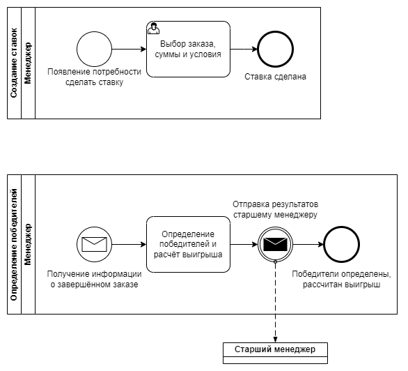
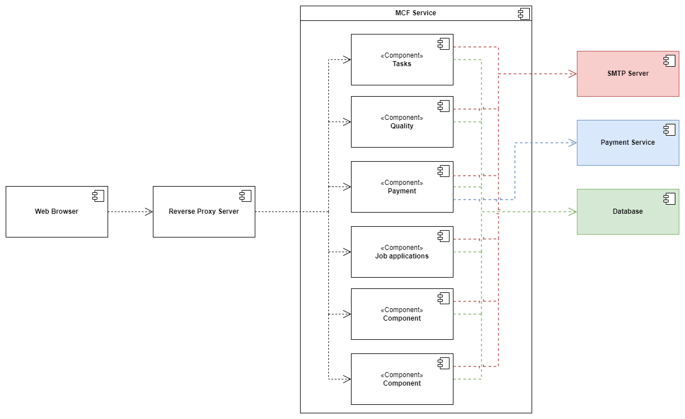

# Домашняя работа №0

## Entity-Relationship Diagram

Я начал проработку системы с составления entity-relationship диаграммы, выделил по ходу прочтения User Story основные сущности и связи между ними.
Указанные на диаграмме атрибуты являются необходимыми для каждой сущности, но не достаточными, скорее всего они будут дополнены позже.
Также у нескольких сущностей на диаграмме атрибуты отмечены знаками вопроса `???`, это означает, что у сущности есть атрибуты, но на данном этапе анализа невозможно их описать.
На схеме у каждой сущности выделен unique id, он может быть как простым автоинкрементом или GUID, так и составным из нескольких атрибутов. На данном этапе этот вопрос не прорабатывался.

При разработке ER диаграмы я принял ряд допущений, которые перечислил ниже. По сути это вопросы и неочевидные места из US, которые в реальной жизни я бы уточнял у заказчика.

1) Принимаем, что термины задача, задание, услуга и заказ из US означают одно и то же
2) Одни и те же менеджеры ведут и заказчиков и исполнителей
3) Сотрудники отдела качества -- это не то же самое, что менеджеры из п.2

В результате на схеме можно выделить три слабо связанные друг с другом группы сущностей:
1) Оценка качества
2) Расходники
3) Все остальные сущности, связанные с заказами, заказчиками, исполнителями и менеджерами

У сущности "Подрядчик" пока нет связей с другими сущностями, но по описанию из US эта сущность попадает во вторую группу на уровне бизнес-процессов.
Группа 3 пока состоит из большого количества связанных между собой сущностей, поэтому без проработки бизнес процессов сложно было бы корректно разделить её на меньшие подгруппы.
Предварительно я делаю предположение, что группы 1 и 2 будут представлять из себя логически обособленные модули в системе, но, конечно, пока об этом сложно судить.

## Business Process Diagram

Далее по описанным User Story я составил диаграммы бизнес-процессов в BPMN нотации. Для удобства в некоторых случаях я выделял повторяющиеся или обособленные логически действия в отдельные диаграммы. В итоге получилось 6 отдельных групп бизнес-процессов:

1) Заказы
2) Качество заказов
3) Платежи
4) Приём на работу
5) Расходники
6) Ставки

Некоторые из групп можно было разбить ещё более мелко, например, выделить отдельно платежи для заказчиков и исполнителей. На текущий момент я принял решение для простоты объединить их в одну группу, при этом важно понимать, что в будущем эти бизнес-процессы могут сильно отличаться друг от друга, поэтому при разработке обоих бизнес-процессов не рекомендуется переиспользовать общие компоненты для реализации бизнес-логики.

Также были приняты следующие допущения:

Разбил флоу заказа на три для удобства 
2) В US-160 под менеджером понимается сотрудник отдела качества
2) В US-270 нет чёткого описания, кому должны приходить какие уведомления, поэтому тут я руководствовался здравым смыслом

### Заказы

*(эта и последующие диаграммы будет более читабельны при открытии их в новой вкладке)*

### Качество заказов

### Платежи

### Приём на работу

### Расходники

### Ставки

## Component Diagram

Т.к. разработка системы ведётся с нуля, целесообразно на текущем этапе разработать монолитное приложение. Общая нагрузка на сервис будет недостаточна для того, чтобы была потребнось масштабировать отдельные компоненты системы. Также скорее всего пока разработка будет вестить небольшим количеством инженеров, поэтому не будет необходимости в выделении отдельных команд для разработки конкретных микросервисов и их независимого деплоя. При этом раазработка монолитного приложения зачастую приводит к тому, что бизнес-логика отдельных компонентов переплетается между собой и в дальнейшем становится сложно выделить отдельные loosely coupled части системы. Для предотвращения этого риска предполагается разделить монолитное приложение на логически обособленные модули с независимой друг от друга бизнес-логикой. Перечень таких модулей сформирован на этапе проработки диаграммы бизнес-процессов. Такая структура позволит выделить модули монолита в отдельные микросервисы в случае увеличении нагрузки на отдельные части сервиса.

Для хранения данных будет использоваться OLTP база данных, т.к. важным критерием будет являться необходимость в ACID транзакциях, т.к. все модули приложения будут работать с одной базой данных, и поэтому необходимо предотвратить ситуации, при которых два независимых друг от друга модуля одновременно вносят изменения в одну и ту же запись в базе данных. Оборотной стороной такого решения будет вероятность возникновения ситуаций, когда открытая одним из модулей транзакция будет "тормозить" работу других модулей.

Поскольку есть угроза ddos атак на сервис, доступ к сервису со стороны клиентов будет осществляться через обратный прокси сервер.

Для рассылки уведомлений предполагается использовать SMTP сервер.

Ещё одной зависимостью для разрабатываемой будет платёжный сервис. При этом важно отметить, что всё взаимодействие с этим сервисом сконцентрировано в рамках одного модуля, который отвечает за обработку платежей.

Ниже представлена диаграмма компонентов в UML нотации, которая иллюстрирует получившуюся систему.

