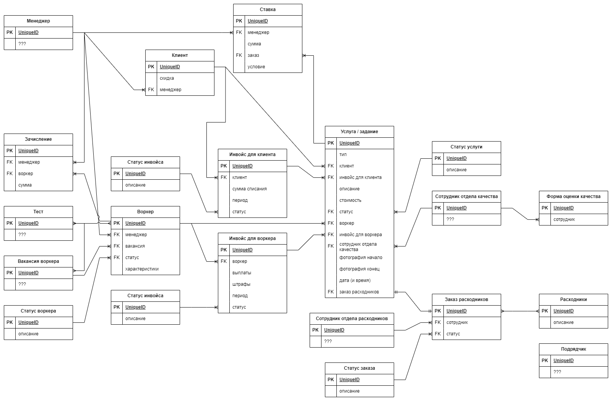

# Домашняя работа №0

## Entity-Relationship Diagram

Я начал проработку системы с составления entity-relationship диаграммы, выделил по ходу прочтения User Story основные сущности и связи между ними.
Указанные на диаграмме атрибуты являются необходимыми для каждой сущности, но не достаточными, скорее всего они будут дополнены позже.
Также у нескольких сущностей на диаграмме атрибуты отмечены знаками вопроса `???`, это означает, что у сущности есть атрибуты, но на данном этапе анализа невозможно их описать.
На схеме у каждой сущности выделен unique id, он может быть как простым автоинкрементом или GUID, так и составным из нескольких атрибутов. На данном этапе этот вопрос не прорабатывался.

При разработке ER диаграмы я принял ряд допущений, которые перечислил ниже. По сути это вопросы и неочевидные места из US, которые в реальной жизни я бы уточнял у заказчика.

1) Принимаем, что термины задача, задание, услуга и заказ из US означают одно и то же
2) Одни и те же менеджеры ведут и клиентов и воркеров
3) Сотрудники отдела качества -- это не то же самое, что менеджеры из п.2

В результате на схеме можно выделить три слабо связанные друг с другом группы сущностей:
1) Оценка качества
2) Расходники
3) Все остальные сущности, связанные с заказами, клиентами, воркерами и менеджерами

У сущности "Подрядчик" пока нет связей с другими сущностями, но по описанию из US эта сущность попадает во вторую группу на уровне бизнес-процессов.
Группа 3 пока состоит из большого количества связанных между собой сущностей, поэтому без проработки бизнес процессов сложно было бы корректно разделить её на меньшие подгруппы.
Пока я делаю предположение, что группы 1 и 2 будут представлять из себя логически обособленные модули в системе, но, конечно, пока об этом сложно судить.
