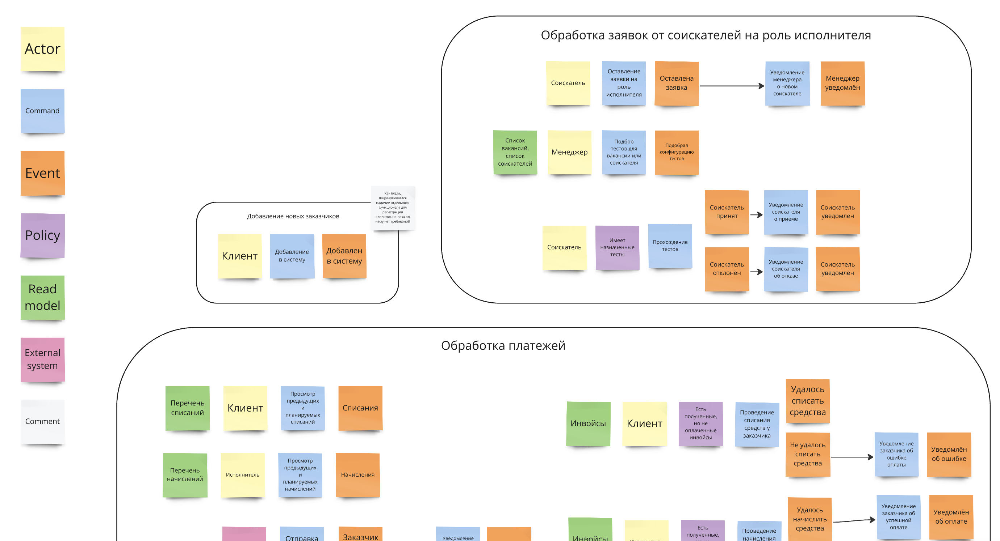

# Домашняя работа №0

## Event Storming модель

Модель доступна по [ссылке](https://miro.com/app/board/uXjVLr3CjCk=/?share_link_id=346059167375).

При группровке команд и событий по контекстам я старался объединять в рамках одного контекста один (или несколько похожих) бизнес процессов.
Например, все команды и события, которые были связаны с обработкой заказов, были выделены в один контекст. При таком разделении между контекстами очень мало или совсем нет. 
Контексты получились очень разными по "размеру", самыми большими оказались обработка заказов и платежей, при этом сходу у меня не получилось выделить из них дополнительно логически обособленные элементы. 
