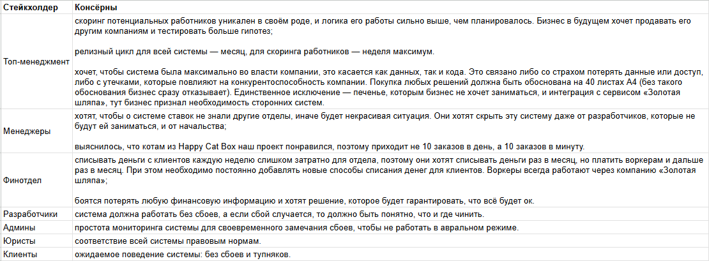
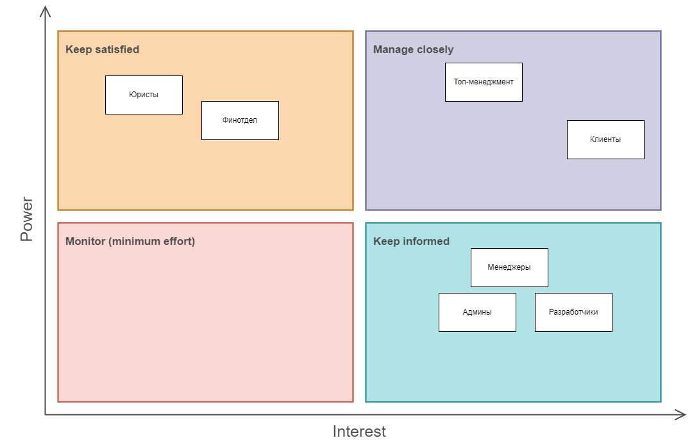
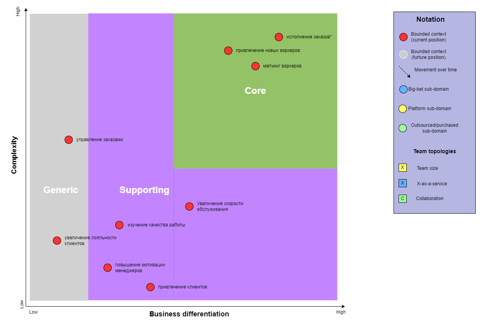
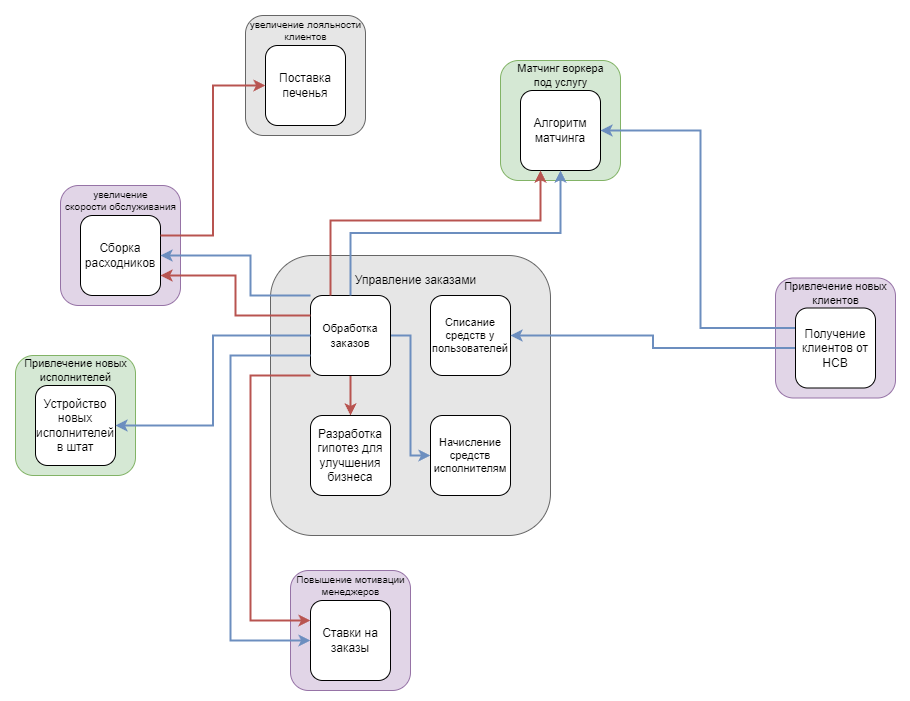

# Домашняя работа №3

## Матрица стейкхолдеров

Для наглядности приведу таблицу со стейкхолдерами и их консёрнами:

*(в markdown таблица ломала проверку орфографии в документе, поэтому прикладываю картинку)*

На матрице стейкхолдеров я расположил группы в зависимости их влияния и интереса к проекту.

**Высокий уровень влияния — Высокий интерес.**
В это область графика я поместил тех стейкхолдеров, от которых больше всего зависит благополучие бизнеса.
Клиенты генерируют прибыль, поэтому их влияние и интерес высоки (в противном случае они не будут клиентами, уйдут к конкурентам и т. д.)
Топ-менеджмент отвечает за стратегическое управление, поэтому их влияние велико, а значит, что и консёрны важны.

**Высокий уровень влияния — Низкий интерес.**
Я делаю предположение, что юридический и финансовый отдел имеют большое влияние в компании, т.к. занимаются важными задачами для функционирования бизнеса.
При этом они не участвуют в разработке нашего продукта напрямую поэтому будет достаточно следить за их удовлетворением.

**Низкое влияние — Высокий интерес.**
В этой области графика я расположил группы исполнителей, которые напрямую задействованы в разработке продукта, но при этом не имеют достаточной власти для принятия влияющих на бизнес решений.

**Низкое влияние — Низкий интерес.**
Эту область графика я оставил пустой, в моём понимании все перечисленные в задании стейкхолдеры важны и их консёрны нужно удовлетворить.

## Core domain chart

На диаграмме ниже приведена обновлённая версия core domain chart.
Поскольку в общее тз были добавлены user story с описанием нового алгоритма матчинга, я принимаю допущение, что он уже был разработан и поэтому поддомен сдвинут вверх по оси complexity.
Поддомен исполнение заказов отмечен на графике звёздочкой, потому что он представляет из себя исполнителей, которые физически выполняют задачи, а не часть разрабатываемой нами системы.

## Изолированные контексты

Ниже приведена обновлённая диаграмма изолированных контекстов.

*(связи между контекстами основаны на event storming диаграмме и модели данных, которые представлены ниже)*

## Event Storming

Обновлённая диаграмма доступна по [ссылке](https://miro.com/app/board/uXjVLr3CjCk=/?moveToWidget=3458764615389611697&cot=14).

## Модель данных

На модели данных была добавлена связь контекста от получения клиентов от HCB к контексту с алгоритмом матчинга, потому что в новой версии матчинга используются не только данные об исполнителях, но и о клиентах.
Также я выделил поставку печенья в отдельный контекст, потому как согласно core domain chart поставка печенья находится в отдельном поддомене.

## Архитектурные характеристики

Привожу общие характеристики системы, собранные на основе требований в предыдущей домашке:

| Требования к системе                                                                                             | Характеристики                              |
| ---------------------------------------------------------------------------------------------------------------- | ------------------------------------------- |
| Бизнесу необходим низкий ТТМ                                                                                     | agility  testability  deployability |
| Ожидается высокая нагрузка, есть вероятность ddos атаки                                                          | availability  scalability               |
| Для бизнеса критично проверять новые гипотезы и изменять уже существующие с максимальной скоростью и надёжностью | agility  modifiability  reliability |
