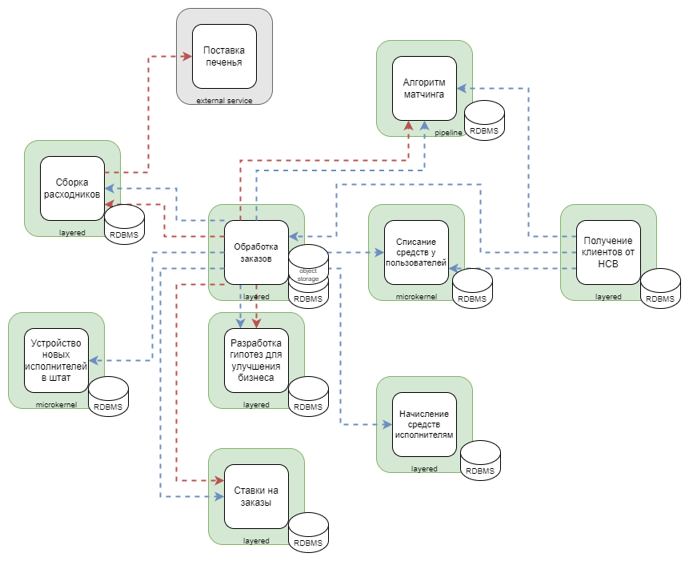
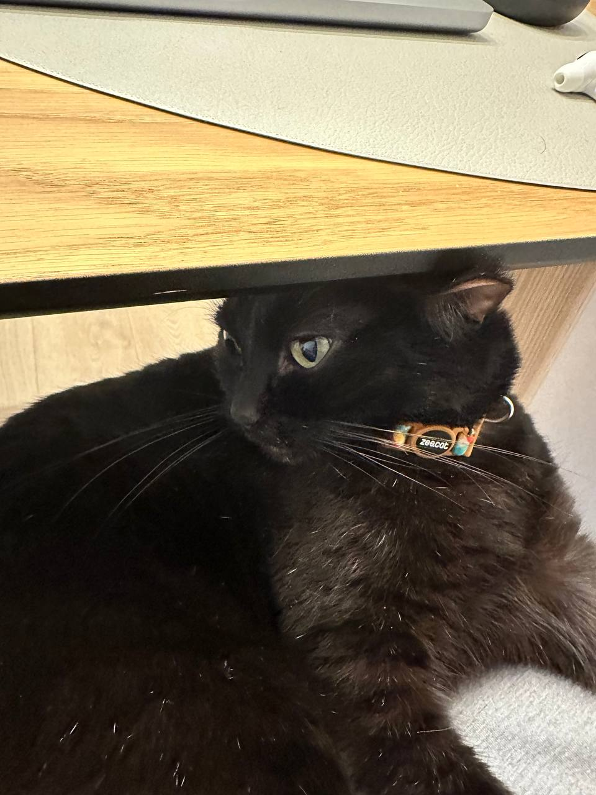

# Домашняя работа №3

## Матрица стейкхолдеров

Для наглядности приведу таблицу со стейкхолдерами и их консёрнами:

*(в markdown таблица ломала проверку орфографии в документе, поэтому прикладываю картинку)*

На матрице стейкхолдеров я расположил группы в зависимости их влияния и интереса к проекту.

**Высокий уровень влияния — Высокий интерес.**
В это область графика я поместил тех стейкхолдеров, от которых больше всего зависит благополучие бизнеса.
Клиенты генерируют прибыль, поэтому их влияние и интерес высоки (в противном случае они не будут клиентами, уйдут к конкурентам и т. д.)
Топ-менеджмент отвечает за стратегическое управление, поэтому их влияние велико, а значит, что и консёрны важны.

**Высокий уровень влияния — Низкий интерес.**
Я делаю предположение, что юридический и финансовый отдел имеют большое влияние в компании, т.к. занимаются важными задачами для функционирования бизнеса.
При этом они не участвуют в разработке нашего продукта напрямую поэтому будет достаточно следить за их удовлетворением.

**Низкое влияние — Высокий интерес.**
В этой области графика я расположил группы исполнителей, которые напрямую задействованы в разработке продукта, но при этом не имеют достаточной власти для принятия влияющих на бизнес решений.

**Низкое влияние — Низкий интерес.**
Эту область графика я оставил пустой, в моём понимании все перечисленные в задании стейкхолдеры важны и их консёрны нужно удовлетворить.

## Core domain chart

На диаграмме ниже приведена обновлённая версия core domain chart.
Поскольку в общее тз были добавлены user story с описанием нового алгоритма матчинга, я принимаю допущение, что он уже был разработан и поэтому поддомен сдвинут вверх по оси complexity.
Поддомен исполнение заказов отмечен на графике звёздочкой, потому что он представляет из себя исполнителей, которые физически выполняют задачи, а не часть разрабатываемой нами системы.

## Изолированные контексты

Ниже приведена обновлённая диаграмма изолированных контекстов.

*(связи между контекстами основаны на event storming диаграмме и модели данных, которые представлены ниже)*

## Event Storming

Обновлённая диаграмма доступна по [ссылке](https://miro.com/app/board/uXjVLr3CjCk=/?moveToWidget=3458764615389611697&cot=14).

## Модель данных

На модели данных была добавлена связь контекста от получения клиентов от HCB к контексту с алгоритмом матчинга, потому что в новой версии матчинга используются не только данные об исполнителях, но и о клиентах.
Также я выделил поставку печенья в отдельный контекст, потому что согласно core domain chart поставка печенья находится в отдельном поддомене.

## Архитектурные характеристики

В таблице приведены архитектурные характеристики для отдельных элементов и системы в целом, полученные на основе требований к системе.
Требования были собраны из консёрнов стейкхолдеров, общих ограничений и user story из тз.
Требование о соответствии правовым нормам я не смог перевести в архитектурные характеристики напрямую, поэтому принимаю допущение, что выполнение этого требования не добавляет новых характеристик.
Также требование о сокрытии системы ставок скорее говорит о необходимости выделения этого элемента в отдельный сервис, чем о необходимости выбора каких-то дополнительных характеристик.

| Контекст                        | Требование                                                                                                        | Характеристика                              |
| ------------------------------- | ----------------------------------------------------------------------------------------------------------------- | ------------------------------------------- |
| матчинг                         | релизный цикл для всей системы — месяц, для скоринга работников — неделя максимум                                 | deployability                               |
| матчинг                         | необходимо иметь возможность добавлять или редактировать шаги матчинга, как нам это необходимо                    | agility  modifiability                  |
| начисление средств исполнителям | сохранность финансовой информации                                                                                 | security                                    |
| начисление средств исполнителям | соблюдение CatFinComplience, который говорит об особом способе хранения данных и особой наблюдаемости за системой | security  consistency                   |
| общее                           | бизнесу необходим низкий ТТМ                                                                                      | agility  testability  deployability |
| общее                           | чтобы система была максимально во власти компании, это касается как данных, так и кода                            | security                                    |
| общее                           | система должна работать без сбоев                                                                                 | availability                                |
| общее                           | если сбой случается, то должно быть понятно, что и где чинить                                                     | maintainability                             |
| общее                           | простота мониторинга системы для своевременного замечания сбоев                                                   | maintainability                             |
| общее                           | соответствие всей системы правовым нормам                                                                         | *                                           |
| общее                           | ожидаемое поведение системы: без сбоев и тупняков                                                                 | consistency  usability                  |
| списание средств у клиентов     | списывать деньги с клиентов раз в месяц, а не каждую неделю                                                       | modifiability                               |
| списание средств у клиентов     | необходимо постоянно добавлять новые способы списания денег для клиентов                                          | agility  modifiability                  |
| списание средств у клиентов     | сохранность финансовой информации                                                                                 | security  consistency                   |
| списание средств у клиентов     | соблюдение CatFinComplience, который говорит об особом способе хранения данных и особой наблюдаемости за системой | security  consistency                   |
| ставки                          | о системе ставок не должны знать другие отделы и незаинтересованные сотрудники                                    | *                                           |
| обработка заказов               | приходит не 10 заказов в день, а 10 заказов в минуту                                                              | availability  scalability               |
| устройство новых исполнителей   | ожидается высокая нагрузка, есть вероятность ddos атаки                                                           | availability  scalability               |
| устройство новых исполнителей   | проверять новые гипотезы и изменять уже существующие с максимальной скоростью и надёжностью                       | agility  modifiability  reliability |

## Выбор архитектурного стиля
Поскольку к разным элементам системы есть разные требования по безопасности и частоте деплоя, монолитные стили не подходят.
Необходимо разделить систему на отдельные (микро-)сервисы и для каждого из них выбрать архитектурный стиль.

1. Релизный цикл системы матчинга чаще по сравнению с остальной системой, поэтому имеет смысл этот контекст выделить в отдельный сервис.
2. В контексте по начислению средств исполнителей требуется соблюдение финансового комплаенса, поэтому для изоляции этого требования контекст выносится в отдельный сервис.
3. Аналогично, контекст списания средств у клиентов имеет требование по соблюдению финансового комплаенса. При этом есть требования по agility и modifiability, поэтому необходимо выделить этот контекст в отдельный сервис вместо объединения с сервисом по начислению средств.
4. Поскольку есть требование о сокрытии информации о ставках от незаинтересованных лиц, этот контекст выделяется в отдельный сервис.
5. У контекста по обработке заказов есть требования по availability и scalability. Для того, чтобы обеспечить возможность масштабировать функционал этого контекста без привязки к остальной системе, я выделяю его в отдельный сервис.
6. У контекста по устройству новых исполнителей есть аналогичные требования по масштабированию, также нужна отказоустойчивость при ожидающихся ddos-атаках, а также есть требование по быстрой проверке гипотез, всё это говорит о необходимости выделения контекста в отдельный сервис.
7. Поставка печенья реализуется сторонним подрядчиком, поэтому будем рассматривать этот контекст как отдельную внешнюю систему.
8. Остаётся три контекста, к которым не было предъявлено особых требований: сборка расходников, получение клиентов и разработка гипотез по улучшению бизнеса. Так как эти контексты не связаны между собой, каждый из них можно реализовывать в виде отдельного сервиса.

Дальше необходимо выбрать архитектурный стиль для каждого отдельного сервиса.

1. Поскольку использование алгоритма матчинга составляет ряд последовательных шагов, применим для этого сервиса стиль **pipeline**.
2. У сервиса по списанию средств у клиентов есть требование к возможности постоянного добавления нового функционала (интеграции с разными платёжными сервисами). Из этого требования следует, что необходимо выбрать стиль **microkernel**, который как раз позволяет сервису иметь высокую расширяемость и конфигурируемость.
3. Сервис по устройству новых исполнителей также имеет требование к возможности быстрого добавления и изменения функционала, поэтому для него также был выбран стиль **microkernel**.
4. Для остальных сервисов нет дополнительных требований влияющих на архитектурный стиль, а также каждый из них включает в себя только один изолированный контекст. Поэтому для остальных сервисов я выбрал стиль **layered**.

## Выбор баз данных

1. Для сервиса начисление средств исполнителям нужна отдельная БД с соблюдением требования по consistency, поэтому для него я выбрал реляционную базу данных.
2. Аналогично, для сервиса по списанию средств у клиентов важна характеристика consistency, поэтому выбрана отдельная реляционная база данных.
3. Сервис ставок должен быть скрыт от незаинтересованных лиц, поэтому  для него также выбрана отдельная реляционная база данных.
4. Сервисы по обработке заказов и устройству новых исполнителей нужно масштабировать по отдельности друг от друга и ото всей системы, поэтому для каждого из них я выбрал отдельную реляционную базу данных.
5. Также сервису по обработке заказов нужно файловое хранилище для хранения относящихся к заказам фотографий.
6. Для остальных сервисов нет отдельных требований, указывающих на характеристики базы данных, но есть общее требование по availability. Поскольку репликация данных среди оставшихся сервисов не нужна (все сервисы получают данные из других источников, но не обмениваются между собой), то для каждого из них я выбрал использование отдельной реляционной бд.

## Выбор коммуникаций между сервисами

1. Между сервисом по сборке расходников и внешним сервисом по поставке печенья будут осуществляться асинхронные коммуникации (отправка уведомления на почту).
2. Сервис по получению клиентов от HCB передаёт данные по клиентам в сервис матчинга, обработки заказов и списания средств у пользователей. Для работы сервиса получения клиентов не нужно получать мгновенный ответ от этих двух сервисов, поэтому я выбираю асинхронный event-driven стиль.
сборка расходников,
3. Сервис по обработке заказов должен передавать данные по заказам в сервисы: сборка расходников, списание средств у пользователей, начисление средств исполнителям, ставки, разработка гипотез для улучшения бизнеса. Сервису обработки заказов не нужен ответ, поэтому можно использовать асинхронные event-driven коммуникации. Сервис обработки заказов будет отправлять сообщение о создании новых или изменении существующих заказов, а остальные сервисы будут читать эти сообщения.
4. Сервис по обработке заказов должен передавать данные по менеджерам в сервис устройство новых исполнителей и сервис ставок. Аналогично используется асинхронная event-driven коммуникация с событиям о создании/изменении экземпляров сущности менеджер.
5. Сервис по обработке заказов должен передавать данные по исполнителям в сервис начисления средств исполнителям. Аналогично предыдущим двум случаям, сервису обработки заказов достаточно опубликовать событие о создании/изменении экземпляров сущности воркер.
6. Сервис по обработке заказов должен отправить событие о создании нового заказа, а сервисы матчинга и сборки расходников должны его прочитать и отреагировать на это событие. Поскольку событие нужно отправить в два места сразу, а ответ сервису по обработке заказов не нужен, то здесь я также буду использовать асинхронную event-driven коммуникацию.
7. Сервис по обработке заказов должен отправить событие о завершении нового заказа в сервис ставок. Аналогично, ответ сервису по обработке заказов не нужен, поэтому использую асинхронную event-driven коммуникацию.
8. Сервис по обработке заказов должен отправить событие об отмене заказа в сервисы ставок и разработки гипотез. Аналогично предыдущим коммуникациям, сервису по обработке заказов не нужен ответ, поэтому здесь тоже буду использовать асинхронную event-driven коммуникацию.

## Итоговая смеха микросервисов

Получившаяся схема с микросервисами, их архитектурными стилями, базами данных и коммуникациями представлена ниже.

Зелёным выделены микросервисы, серым -- внешние сервисы. Белым цветом показаны изолированные контексты.

Красными стрелками показаны коммуникации на основе событий в event storming'е, а синие -- на основе стриминга данных между базами разных микросервисов.
Подписывать коммуникации не стал, чтобы не захламлять диаграмму.

## Фитнес-функции

Не успел сделать этот раздел до дедлайна :(

## ADR

ADR по выбору архитектурного стиля доступен по [ссылке](adr.md).

## Кот

*По традиции, в конце домашки показываю Салема*