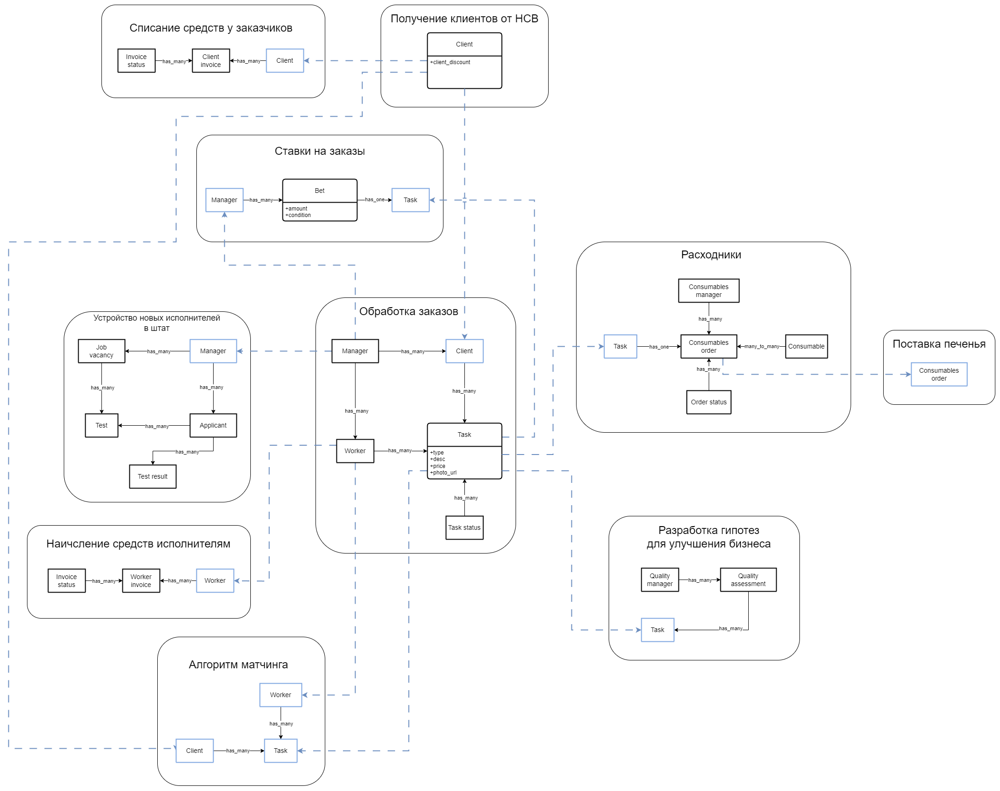

# Домашняя работа №3

## Матрица стейкхолдеров

Для наглядности приведу таблицу со стейкхолдерами и их консёрнами:

*(в markdown таблица ломала проверку орфографии в документе, поэтому прикладываю картинку)*

На матрице стейкхолдеров я расположил группы в зависимости их влияния и интереса к проекту.

**Высокий уровень влияния — Высокий интерес.**
В это область графика я поместил тех стейкхолдеров, от которых больше всего зависит благополучие бизнеса.
Клиенты генерируют прибыль, поэтому их влияние и интерес высоки (в противном случае они не будут клиентами, уйдут к конкурентам и т. д.)
Топ-менеджмент отвечает за стратегическое управление, поэтому их влияние велико, а значит, что и консёрны важны.

**Высокий уровень влияния — Низкий интерес.**
Я делаю предположение, что юридический и финансовый отдел имеют большое влияние в компании, т.к. занимаются важными задачами для функционирования бизнеса.
При этом они не участвуют в разработке нашего продукта напрямую поэтому будет достаточно следить за их удовлетворением.

**Низкое влияние — Высокий интерес.**
В этой области графика я расположил группы исполнителей, которые напрямую задействованы в разработке продукта, но при этом не имеют достаточной власти для принятия влияющих на бизнес решений.

**Низкое влияние — Низкий интерес.**
Эту область графика я оставил пустой, в моём понимании все перечисленные в задании стейкхолдеры важны и их консёрны нужно удовлетворить.

## Core domain chart

На диаграмме ниже приведена обновлённая версия core domain chart.
Поскольку в общее тз были добавлены user story с описанием нового алгоритма матчинга, я принимаю допущение, что он уже был разработан и поэтому поддомен сдвинут вверх по оси complexity.
Поддомен исполнение заказов отмечен на графике звёздочкой, потому что он представляет из себя исполнителей, которые физически выполняют задачи, а не часть разрабатываемой нами системы.

## Изолированные контексты

Ниже приведена обновлённая диаграмма изолированных контекстов.

*(связи между контекстами основаны на event storming диаграмме и модели данных, которые представлены ниже)*

## Event Storming

Обновлённая диаграмма доступна по [ссылке](https://miro.com/app/board/uXjVLr3CjCk=/?moveToWidget=3458764615389611697&cot=14).

## Модель данных

На модели данных была добавлена связь контекста от получения клиентов от HCB к контексту с алгоритмом матчинга, потому что в новой версии матчинга используются не только данные об исполнителях, но и о клиентах.
Также я выделил поставку печенья в отдельный контекст, потому что согласно core domain chart поставка печенья находится в отдельном поддомене.

## Архитектурные характеристики

В таблице приведены архитектурные характеристики для отдельных элементов и системы в целом, полученные на основе требований к системе.
Требования были собраны из консёрнов стейкхолдеров, общих ограничений и user story из тз.
Требование о соответствии правовым нормам я не смог перевести в архитектурные характеристики напрямую, поэтому принимаю допущение, что выполнение этого требования не добавляет новых характеристик.
Также требование о сокрытии системы ставок скорее говорит о необходимости выделения этого элемента в отдельный сервис, чем о необходимости выбора каких-то дополнительных характеристик.

| Контекст                        | Требование                                                                                                        | Характеристика                              |
| ------------------------------- | ----------------------------------------------------------------------------------------------------------------- | ------------------------------------------- |
| матчинг                         | релизный цикл для всей системы — месяц, для скоринга работников — неделя максимум                                 | deployability                               |
| матчинг                         | необходимо иметь возможность добавлять или редактировать шаги матчинга, как нам это необходимо                    | agility  modifiability                  |
| начисление средств исполнителям | сохранность финансовой информации                                                                                 | security                                    |
| начисление средств исполнителям | соблюдение CatFinComplience, который говорит об особом способе хранения данных и особой наблюдаемости за системой | security  consistency                   |
| общее                           | бизнесу необходим низкий ТТМ                                                                                      | agility  testability  deployability |
| общее                           | чтобы система была максимально во власти компании, это касается как данных, так и кода                            | security                                    |
| общее                           | система должна работать без сбоев                                                                                 | availability                                |
| общее                           | если сбой случается, то должно быть понятно, что и где чинить                                                     | maintainability                             |
| общее                           | простота мониторинга системы для своевременного замечания сбоев                                                   | maintainability                             |
| общее                           | соответствие всей системы правовым нормам                                                                         | *                                           |
| общее                           | ожидаемое поведение системы: без сбоев и тупняков                                                                 | consistency  usability                  |
| списание средств у клиентов     | списывать деньги с клиентов раз в месяц, а не каждую неделю                                                       | modifiability                               |
| списание средств у клиентов     | необходимо постоянно добавлять новые способы списания денег для клиентов                                          | agility  modifiability                  |
| списание средств у клиентов     | сохранность финансовой информации                                                                                 | security  consistency                   |
| списание средств у клиентов     | соблюдение CatFinComplience, который говорит об особом способе хранения данных и особой наблюдаемости за системой | security  consistency                   |
| ставки                          | о системе ставок не должны знать другие отделы и незаинтересованные сотрудники                                    | *                                           |
| управление заказами             | приходит не 10 заказов в день, а 10 заказов в минуту                                                              | availability  scalability               |
| устройство новых исполнителей   | ожидается высокая нагрузка, есть вероятность ddos атаки                                                           | availability  scalability               |
| устройство новых исполнителей   | проверять новые гипотезы и изменять уже существующие с максимальной скоростью и надёжностью                       | agility  modifiability  reliability |
