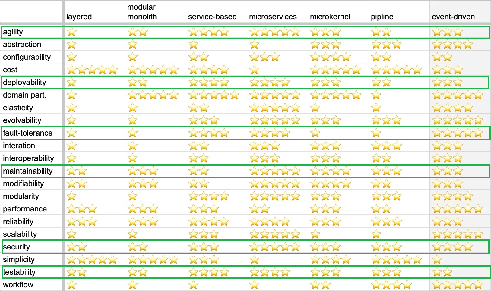

# ADR-001: Выбор архитектурного стиля для Make Cats Free

## Status
Proposed

## Context
Основываясь на требованиях и консёрнах стейкхолдеров, было определено, что необходимо реализовать систему из десяти изолированных контекстов, каждый из которых имеет свой набор характеристик.
Характеристики и требования, из которых они были получены, приведены в таблице:

| Контекст                        | Требование                                                                                                        | Характеристика                              |
| ------------------------------- | ----------------------------------------------------------------------------------------------------------------- | ------------------------------------------- |
| матчинг                         | релизный цикл для всей системы — месяц, для скоринга работников — неделя максимум                                 | deployability                               |
| матчинг                         | необходимо иметь возможность добавлять или редактировать шаги матчинга, как нам это необходимо                    | agility  modifiability                  |
| начисление средств исполнителям | сохранность финансовой информации                                                                                 | security                                    |
| начисление средств исполнителям | соблюдение CatFinComplience, который говорит об особом способе хранения данных и особой наблюдаемости за системой | security  consistency                   |
| общее                           | бизнесу необходим низкий ТТМ                                                                                      | agility  testability  deployability |
| общее                           | чтобы система была максимально во власти компании, это касается как данных, так и кода                            | security                                    |
| общее                           | система должна работать без сбоев                                                                                 | availability                                |
| общее                           | если сбой случается, то должно быть понятно, что и где чинить                                                     | maintainability                             |
| общее                           | простота мониторинга системы для своевременного замечания сбоев                                                   | maintainability                             |
| общее                           | соответствие всей системы правовым нормам                                                                         | *                                           |
| общее                           | ожидаемое поведение системы: без сбоев и тупняков                                                                 | consistency  usability                  |
| списание средств у клиентов     | списывать деньги с клиентов раз в месяц, а не каждую неделю                                                       | modifiability                               |
| списание средств у клиентов     | необходимо постоянно добавлять новые способы списания денег для клиентов                                          | agility  modifiability                  |
| списание средств у клиентов     | сохранность финансовой информации                                                                                 | security  consistency                   |
| списание средств у клиентов     | соблюдение CatFinComplience, который говорит об особом способе хранения данных и особой наблюдаемости за системой | security  consistency                   |
| ставки                          | о системе ставок не должны знать другие отделы и незаинтересованные сотрудники                                    | *                                           |
| обработка заказов               | приходит не 10 заказов в день, а 10 заказов в минуту                                                              | availability  scalability               |
| устройство новых исполнителей   | ожидается высокая нагрузка, есть вероятность ddos атаки                                                           | availability  scalability               |
| устройство новых исполнителей   | проверять новые гипотезы и изменять уже существующие с максимальной скоростью и надёжностью                       | agility  modifiability  reliability |

Хотя каждый из элементов содержит свой набор характеристик, необходимых только ему, есть характеристики, которые являются общими для всей системы.
Для этих трёх характеристик и будет выбираться архитектурный стиль всей системы.

Для этого будет рассмотрено семь архитектурных стилей, которые приведены в таблице ниже:

Примечание, таблице по сравнению вариантов архитектуры не было характеристики *availability*, я взял *fault tolerance* как аналогичный по смыслу показатель.

## Decision

По таблице с вариантами архитектурного стиля больше всего подходят два варианта распределённой архитектуры -- сервисная архитектура и микросервисы.
При этом по характеристикам agility, maintainability и security микросервисы превосходят сервисный вариант при равных значениях по остальным характеристикам.
Дополнительно, требования по комплаенсу для сервисов по списанию и начислению средств предполагают наличие отдельной изолированной базы данных для каждого из этих сервисов.
Также есть требование по сокрытию сервиса ставок ото всех незаинтересованных лиц, что также предполагает наличие отдельной базы данных.
Кроме того, для сервисов обработки заказов и устройства новых исполнителей есть требования по независимому масштабированию, а все остальные сервисы работают с не связанными между собой данными, поэтому нет смысла использовать для них совмещённую базу данных.

Таким образом, была выбрана микросервисная архитектура.

## Consequences

В результате выбора микросервисной архитектуры усложняется процесс разработки и администрирования системы, понадобится нанимать более высококвалифицированных разработчиков и администраторов.

## Сompliance

Так как нет вариантов автоматической проверки реализации архитектурного стиля, то вся проверка будет делаться вручную посредством изучения проектной документации, кода и автоматически генерируемой карты сервисов, основанной на инструментах трассировки.

## Alternatives

В качестве альтернативы были рассмотрены варианты многослойной и модульной монолитной архитектуры, а также сервисный стиль но они уступают по выбранным характеристикам согласно приведённой выше таблице.
