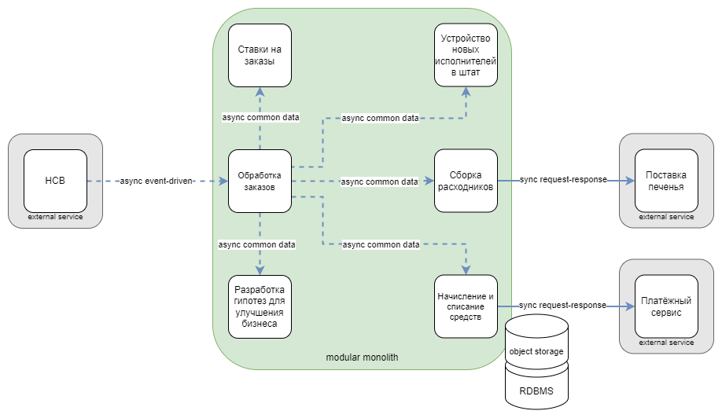

# Домашняя работа №4

## Архитектура

На первой схеме изображена изначальная версия архитектуры.
Более подробно эта версия описана в [нулевой домашке](../hw0/README.md).

На второй схеме изображена обновлённая версия архитектуры, которую я получил во время прохождения курса.

По сравнению с версией из [третьей домашки](../hw3/README.md) по результатам обратной связи я сделал следующие изменения:
* добавил внешние сервисы, про которые я забыл
* заменил тип коммуникации с асинхронного event-driven на синхронный request-response при взаимодействии со внешними сервисами поставки печенья и платёжным сервисом, 
* заменил тип коммуникации с асинхронного event-driven на синхронный request-response при взаимодействии сервиса обработки заказов с сервисом матчинга
* убрал отдельный сервис для получения клиентов из HCB, теперь его функционал включен в сервис обработки заказов
* в сервисе матчинга заменил РСУБД на документо-ориентированное хранилище для более удобной работы с неструктурированными данными

## Instability

### Core

**Устройство новых исполнителей в штат:**

Instability = 0 / (1 + 0) = 0

**Матчинг:**

Instability = 0 / (1 + 0) = 0

### Supporting

**Ставки на заказы:**

Instability = 0 / (1 + 0) = 0

**Сборка расходников:**

Instability = 1 / (1 + 1) = 0.5

### Generic

**Обработка заказов:**

Instability = 7 / (7 + 1) = 0.875

**Разработка гипотез для улучшения бизнеса:**

Instability = 0 / (0 + 1) = 0

**Списание средств у пользователей:**

Instability = 1 / (1 + 1) = 0.5

**Начисление средств исполнителям:**

Instability = 1 / (1 + 1) = 0.5

Из расчётов видно, что core сервисы наиболее стабильны, а самый нестабильный generic сервис обработки заказов, который связан со всеми остальными сервисами.

# Изменения в архитектуре

В обновлённой версии архитектуры произошли следующие изменения:

* модульный монолит превратился в распределённую систему с микросервисной архитектурой
* контекст по начислению и списанию средств был разделён на два отдельных контекста для начисления и списания, каждый из которых представлен отдельным микросервисом
* добавился новый контекст матчинга (в старой реализации его не было, потому что не было алгоритма матчинга как такового)
* в старой версии контексты были представлены модулями внутри монолита, коммуникация между которыми была асинхронной common data; в новой версии контексты представлены микросервисами, коммуникации между которыми стали асинхронными event-driven (за исключением коммуникации между обработкой заказов и матчингом, где используется синхронная request-response коммуникация)

