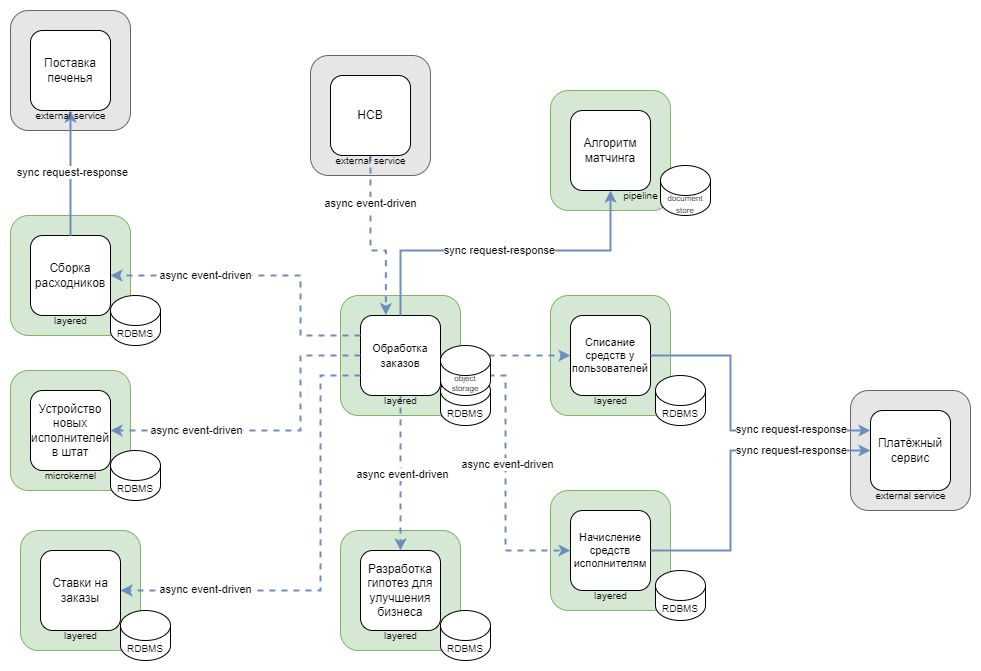

# Домашняя работа №4

## Архитектура

На первой схеме изображена изначальная версия архитектуры.
Более подробно эта версия описана в [нулевой домашке](../hw0/README.md).

На второй схеме изображена обновлённая версия архитектуры, которую я получил во время прохождения курса.

По сравнению с версией из [третьей домашки](../hw3/README.md) по результатам обратной связи я сделал следующие изменения:
* добавил внешние сервисы, про которые я забыл
* заменил тип коммуникации с асинхронного event-driven на синхронный request-response при взаимодействии со внешними сервисами поставки печенья и платёжным сервисом, 
* заменил тип коммуникации с асинхронного event-driven на синхронный request-response при взаимодействии сервиса обработки заказов с сервисом матчинга
* убрал отдельный сервис для получения клиентов из HCB, теперь его функционал включен в сервис обработки заказов
* в сервисе матчинга заменил РСУБД на документо-ориентированное хранилище для более удобной работы с неструктурированными данными
* изменил тип сервиса по списанию средств у пользователей с microkernel на layered

## Instability

### Core

**Устройство новых исполнителей в штат:**

Instability = 0 / (1 + 0) = 0

**Матчинг:**

Instability = 1 / (1 + 1) = 0.5

У сервиса есть синхронная коммуникация, поэтому при расчётах учитываем схему данных.

### Supporting

**Ставки на заказы:**

Instability = 0 / (1 + 0) = 0

**Сборка расходников:**

Instability = 1 / (1 + 2) = 0.334

У сервиса есть синхронная коммуникация, поэтому при расчётах учитываем схему данных.

### Generic

**Обработка заказов:**

Instability = 7 / (7 + 2) = 0.778

У сервиса есть синхронная коммуникация, поэтому при расчётах учитываем схему данных.

**Разработка гипотез для улучшения бизнеса:**

Instability = 0 / (0 + 1) = 0

**Списание средств у пользователей:**

Instability = 1 / (1 + 2) = 0.334

У сервиса есть синхронная коммуникация, поэтому при расчётах учитываем схему данных.

**Начисление средств исполнителям:**

Instability = 1 / (1 + 2) = 0.334

У сервиса есть синхронная коммуникация, поэтому при расчётах учитываем схему данных.

Из расчётов видно, что самый нестабильный generic сервис обработки заказов, который связан со всеми остальными сервисами.
Core сервис по устройству новых исполнителей стабилен, а у сервиса матчинга стабильность средняя из-за наличия синхронной связи с сервисом по обработке заказа.
При этом наличие синхронной связи между этими двумя сервисами важно, так как сервис по обработке заказов должен быстро получать ответ от сервиса матчинга.

# Изменения в архитектуре

В обновлённой версии архитектуры произошли следующие изменения:

* модульный монолит превратился в распределённую систему с микросервисной архитектурой
* контекст по начислению и списанию средств был разделён на два отдельных контекста для начисления и списания, каждый из которых представлен отдельным микросервисом
* добавился новый контекст матчинга (в старой реализации его не было, потому что не было алгоритма матчинга как такового)
* в старой версии контексты были представлены модулями внутри монолита, коммуникация между которыми была асинхронной common data; в новой версии контексты представлены микросервисами, коммуникации между которыми стали асинхронными event-driven (за исключением коммуникации между обработкой заказов и матчингом, где используется синхронная request-response коммуникация)

## Планирование изменений, когда есть свободные люди и ресурсы, а опыта и/или инфраструктуры нет

При таких условиях работа по внесению изменений должна начинаться с добавления нового функционала (если он есть), а потом микросервисы выносятся из монолита по увеличению их важности для бизнеса.
Для простоты я делаю допущение, что разработка микросервисов будет вестись на том же языке, на котором был разработан старый монолит.

1. Добавление микросервиса матчинга, так как это новый функционал, которого не было в старой версии архитектуры.
2. Вынесение разработки гипотез для улучшения бизнеса, чтобы команда получила опыт по распилу монолита, он не связан с core поддоменами, а также получившийся микросервис будет самым стабильным из generic сервисов. Тип бд и модель данных не должны измениться, поведение процессов также не меняется, поэтому я выбираю паттерн Tactical Forking.
3. Вынесение ставок на заказы в отдельный микросервис. Получившийся микросервис будет максимально стабильным и также не влияет на core функционал. Тип бд, модель данных и поведение процессов не меняются, поэтому также можно выбрать паттерн Tactical Forking.
4. Вынесение начисления и списания средств и разбиение на два отдельных сервиса. Для этих сервисов важно соблюдать финансовый комплаенс, поэтому выбран паттерн Change Data Capture.
5. Вынесение сборки расходников в отдельный микросервис. Тип бд, модель данных и поведение процессов не меняются, поэтому выбран паттерн Tactical Forking.
6. Вынесение устройства новых исполнителей в штат в отдельный микросервис. У сервиса меняется архитектурный стиль на microkernel, поэтому воспользуемся паттерном Change Data Capture.
7. Из всего монолита остаётся сервис по обработке заказов. Хоть он и generic, я решил не выносить его раньше из-за высокой нестабильности получившегося микросервиса.

## Планирование изменений, когда свободных людей и ресурсов нет, а опыт и/или инфраструктура есть

При таких условиях нужно начинать распил монолита с наиболее важных его частей.

1. Добавление микросервиса матчинга, так как это новый функционал, которого не было в старой версии архитектуры.
2. Вынесение устройства новых исполнителей в штат в отдельный микросервис. Это core сервис, который наиболее важен для бизнеса. У сервиса меняется архитектурный стиль на microkernel, поэтому воспользуемся паттерном Change Data Capture.
3. Вынесение сборки расходников в отдельный микросервис. У этого сервиса сильнее всего растёт нагрузка, нужно масштабировать его отдельно от остального монолита. Тип бд, модель данных и поведение процессов не меняются, поэтому выбран паттерн Tactical Forking.
4. Вынесение ставок на заказы в отдельный микросервис, потому что этот сервис должен быть "скрыт" ото всех заинтересованных лиц. Тип бд, модель данных и поведение процессов не меняются, поэтому также можно выбрать паттерн Tactical Forking.
5. Вынесение начисления и списания средств и разбиение на два отдельных сервиса. Для этих сервисов важно соблюдать финансовый комплаенс, поэтому выбран паттерн Change Data Capture.
6. Вынесение разработки гипотез для улучшения бизнеса. Получившийся сервис будет стабильным, но неважный для бизнеса функционал, поэтому у него низкий приоритет. Тип бд и модель данных не должны измениться, поведение процессов также не меняется, поэтому я выбираю паттерн Tactical Forking.
7. Из всего монолита остаётся сервис по обработке заказов. У него также низкая важность для бизнеса, при этом полученный микросервис будет нестабильным, поэтому его нет смысла выносить раньше.

## Кот

*По традиции, в конце домашки показываю Салема*
